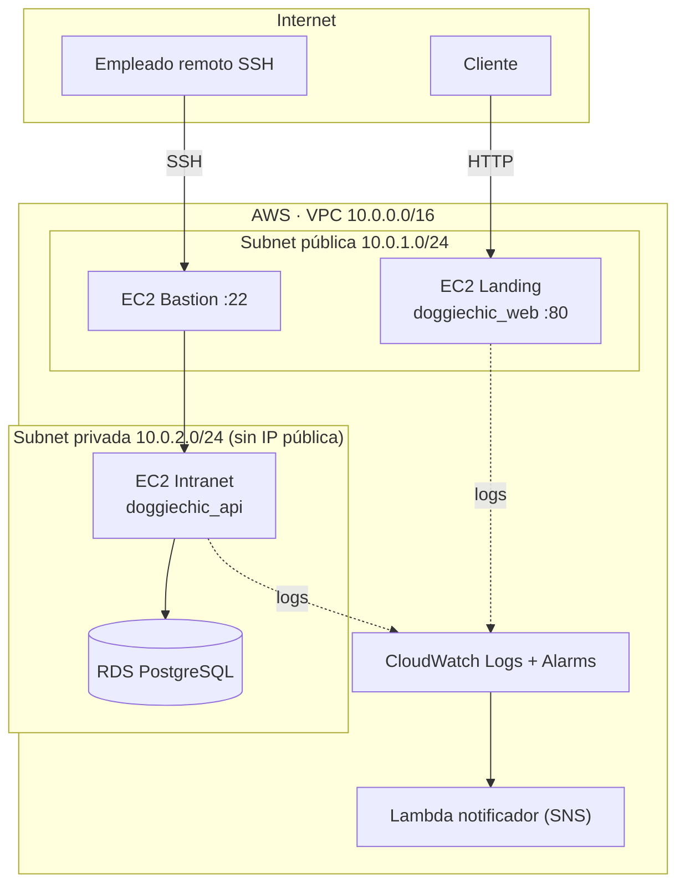

# 🐶 Doggie Chic Studio — Proyecto Final DevOps

Estética canina premium en **Plaza 2048 Paseo de los Leones, Monterrey**.
Proyecto final de Fundamentos de DevOps: **Internet + Intranet** desplegados en **AWS** con Docker, CloudWatch y Lambda.

> Negocio real de referencia: [Doggie Chic Studio](https://doggiechicstudio.com) — baño, corte, spa, higiene y farmacia canina, atención de **9:00 a 20:00**.

---

## 🧭 Arquitectura



Diagrama editable: [`infra/diagram.mmd`](infra/diagram.mmd).

## 🚀 Despliegue rápido (local con Docker)

```bash
./scripts/deploy.sh        # build + up
./scripts/start_app.sh     # levantar
./scripts/stop_app.sh      # detener
./scripts/view_logs.sh     # ver logs locales
./scripts/view_logs.sh aws # tail de logs en CloudWatch
```

## ☁️ Despliegue en AWS (Terraform)

```bash
cd infra/terraform
terraform init
terraform apply             # crea VPC, subredes, EC2 (web/bastion/intranet), RDS, SG, IAM, Log Groups
```

Outputs incluyen IP pública del web, IP del bastion y endpoint privado de la intranet.
La conexión a la intranet se hace mediante **ProxyJump** desde el bastion:

```bash
ssh -J ec2-user@<bastion-ip> ec2-user@<intranet-priv-ip>
```

## ⚡ Lambda + Alarma de CloudWatch

`infra/lambda/index.js` recibe eventos de la alarma y publica en un tópico **SNS**.
Terraform crea:

- Log Groups `/doggiechic/web` y `/doggiechic/intranet`.
- Filtro de métrica que cuenta líneas con `ERROR`.
- Alarma `doggiechic-errors` → SNS → Lambda → notificación.

## 🐳 Servicios Docker

| Servicio | Red | Puerto | Acceso |
|----------|-----|--------|--------|
| `landing` (Vite+React) | publica | 80 | Internet 🌐 |
| `intranet` (Vite+React) | privada | 8080 | solo VPN/Bastion |
| `backend` (Node+Express) | privada | 4000 | solo `landing`/`intranet` |
| `mongodb` (Base de datos) | privada | 27017 | solo `backend` |

## 📜 Logs y Endpoints Backend

- Endpoints principales: `/api/health`, `/api/clientes`, `/api/mascotas`, `/api/servicios`, `/api/logs`
- Logs internos guardados en: `backend/logs/app.log` (gestionado con Winston)
- Enviados a CloudWatch via agente en producción
- Endpoint `/api/error-test` para forzar errores y probar alarmas en AWS Lambda → SNS.
- **No se exponen en la UI**: se consultan en la consola de AWS o con `aws logs tail`.

## 🔐 Seguridad de red

- EC2 Intranet **sin IP pública**.
- Security Group de la intranet permite ingreso únicamente desde el SG del bastion (puerto 22) y del web (puerto 4000).
- RDS solo acepta conexiones desde el SG de la intranet.
- Credenciales de DB en variables de entorno / SSM Parameter Store en producción.

## 🤖 CI/CD

`.github/workflows/ci.yml`:

1. Lint + build del frontend.
2. Build de imágenes Docker (web y api).
3. Push a Amazon ECR (cuando hay credenciales).
4. Despliegue por SSH al bastion y `docker compose up -d` en la intranet.

## 🧠 Reflexión

- **¿Por qué separar Internet e Intranet?** Reducir superficie de ataque y proteger datos sensibles del personal y la operación.
- **Riesgos si todo es público:** robo de datos de clientes, alteración de inventario, ataques DDoS sobre servicios internos.
- **Ventaja de Docker:** mismo entorno en dev/prod, despliegues rápidos y reproducibles, aislamiento por red.
- **Importancia de logs:** trazabilidad, auditoría y diagnóstico de incidentes.
- **Aporte de CloudWatch + Lambda:** observabilidad centralizada, alertas automáticas y respuesta automatizada.
- **En producción:** HTTPS con ACM + ALB, secretos en SSM, CI/CD con GitHub Actions, backups automáticos en RDS, multi-AZ.
